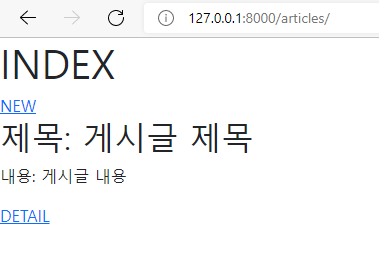

### CRUD with views

- CRUD 활용하여 게시판 만드는 순서

  - python -m venv venv

  - source venv/Scripts/activate

  - pip install django==3.2.12

  - django-admin startproject crud .

  - python manage.py startapp articles

  - settingspy -> installed_app에 articles 추가

  - 프로젝트, 앱 디렉토리와 동등한 위치에 templates 폴더 생성 후 base.html만들기

  - settings.py -> templates -> DIRS : BASE_DIR / 'templates'

  - base.html에 부트스트랩 적용하고 블록 설정

  - models.py 작성

    ```
    #articles/models.py
    class Article(models.Model):
    	title = models.CharField(max_length=10) 
    	content = models.TextField()
    ```

  - python manage.py makemigrations 후 migrations/0001_initial.py 생성 확인

  - python manage.py migrate (0001_initial.py를 실제 DB에 반영)

  - vscode sqlite 확장 프로그램을 통해 확인

  - python manage.py showmigrations 통해 설계도들이 migrate 됐는지 여부 확인 (생략 가능)

  - model 수정하려면 추가 모델 필드 작성 후 makemigrations -> migrate

    (설계도 여러개 만들다가 sql문 꼬였을 시, 다 삭제하고 다시 makemigrations하는게 편함)

  - pip install ipython, pip install django-extensions

  - settings.py로 가서 'django_extensions' 앱 등록

  - python manage.py shell_plus (이곳에서 DB API 사용 가능, shell 종료하려면 exit() 입력) 

  - python manage.py createsuperuser (관리자 계정 생성)

  - admin.py에 model 등록

    ```
    from django.contrib import admin
    from .models import Article
    
    admin.site.register(Article)
    ```

    

- csrf_token template tag (http method를 post로 설정한 경우 사용)

  -  : CSRF(사이트 간 요청 위조) 보호에 사용
  - input type이 hidden으로 작성되며 value는 Django에서 생성한 hash값으로 설정됨
  - 해당 태그 없이 요청을 보낸다면 Django 서버는 403 for bidden을 응답

- redirect() : 새 URL로 요청을 다시 보냄

  ```
  def create(request):
  	title = request.POST.get('title')
  	content = request.POST.get('content')
  	
  	article = Article(title=title, content=content) #CREATE
  	article.save()
  	return redirect('articles:index')
  ```

  1. urls.py

  ```django
  from django.urls import path
  from . import views
  
  app_name = 'articles'
  urlpatterns = [
      path('', views.index, name = 'index'),
      path('new/', views.new, name = 'new'),
      path('create/', views.create, name = 'create'), #new에서 작성한 내용 확인
      path('<int:pk>/', views.detail, name = 'detail'), #게시글 내용
      path('<int:pk>/delete/', views.delete, name = 'delete'), #게시글 삭제
      path('<int:pk>/edit/', views.edit, name='edit'), #게시글 수정
      path('<int:pk>/update/', views.update, name='update')
      
  ]
  ```

  

  2. views.py

  ```django
  from django.shortcuts import render, redirect
  from .models import Article
  
  def index(request):
  
      articles = Article.objects.order_by('-pk')
      context = {
          'articles' : articles
      }
      return render(request, 'articles/index.html', context)
  
  def new(request):
      return render(request, 'articles/new.html')
  
  def create(request):
      title = request.POST.get('title')
      content = request.POST.get('content')
  
      article = Article(title=title, content=content)
      article.save()
  
      return redirect('articles:detail', article.pk)
  
  def detail(request, pk):
      article = Article.objects.get(pk=pk)
      context = {
          'article': article
      }
      return render(request, 'articles/detail.html', context)
  
  def delete(request, pk): #HTTP method가 POST일 경우에만 삭제될 수 있도록 조건 작성
      article = Article.objects.get(pk=pk)
      if request.method == 'POST':
          article.delete()
          return redirect('articles:index')
      else:
          return redirect('articles:detail', article.pk)
  
  def edit(request, pk):
      article = Article.objects.get(pk=pk)
      context = {
          'article' : article
      }
      return render(request, 'articles/edit.html', context)
  
  def update(request, pk):
      article = Article.objects.get(pk=pk)
      article.title = request.POST.get('title')
      article.content = request.POST.get('content')
      article.save()
      return redirect('articles:detail', article.pk)    
  ```

  

  3. articles/templates/articles/index.html

  

  ```django
  
  
  
  
  <h1 class>INDEX</h1>
  <a href="">NEW</a>
  
  <h2>제목: {{article.title}} </h2>
  <p>내용: {{article.content}} </p>
  <a href="">DETAIL</a>
  
  
  ```

  

  4. articles/templates/articles/detail.html

  

  ```django
  
  
  <h1>DETAIL</h1>
  <hr>
  <h2>{{article.title}}</h2>
  <br>
  <h3>{{article.content}}</h3>
  <p>작성일: {{article.created_at}}</p>
  <p>수정일: {{article.updated_at}}</p>
  <a href="" class = 'btn btn-primary'>EDIT</a>
  <form action="">
      
      <button class = 'btn btn-danger'>DELETE</button>
  </form>
  <a href="">BACK</a>
  
  
  ```

  

  5. articles/templates/articles/new.html

  

  

  ```django
  
  
  <h1>NEW</h1>
  <form action="" method = 'POST'>
      
      <label for "title">TITLE: </label>
      <input type="text" name = 'title'>
      <br>
      <label for="content">CONTENT: </label>
      <textarea name="content" id="content" cols="30" rows="10"></textarea>
      <br>
      <input type="submit" value="작성">
  </form>
  <a href="">BACK</a>
  
  ```

  

  6. articles/templates/articles/edit.html

  

  ```django
  
  
  
  <h1>EDIT</h1>
  <form action="" method = 'POST'>
      
      <label for "title">TITLE: </label>
      <input type="text" name = 'title' value={{article.title}}>
      <br>
      <label for="content">CONTENT: </label>
      <textarea name="content" id="content" cols="30" rows="10">{{article.content}}</textarea>
      <br>
      <input type="submit" value="수정">
  </form>
  <a href="">BACK</a>
  
  </form>
  
  
  ```

  

  7. models.py

  ```
  from django.db import models
  
  class Article(models.Model): #테이블
      title = models.CharField(max_length=10) 
      content = models.TextField()
      created_at = models.DateTimeField(auto_now_add=True)
      updated_at = models.DateTimeField(auto_now=True)
  ```

  