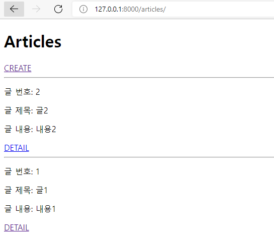
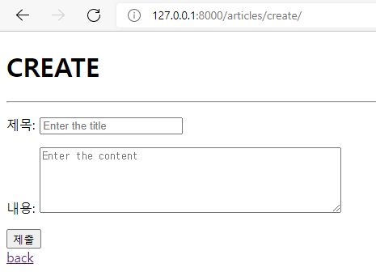
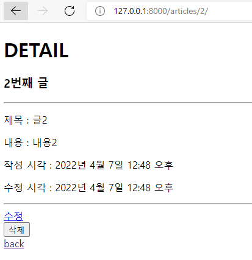
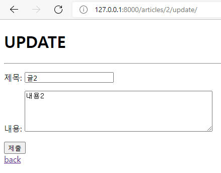

- python -m venv venv

- source venv/Scripts/activate

- pip install django==3.2.12 (pip install -r requirements.txt)

- django-admin startproject crud .

- python manage.py startapp articles

- settings.py -> installed_app에 articles 추가

- urls.py(프로젝트)

```python
from django.contrib import admin
from django.urls import path, include

urlpatterns = [
path('admin/', admin.site.urls),
path('articles/', include('articles.urls')),
]
```

- urls.py(articles 앱)

  - 이전 버전과 비교하면 'new(글쓰기 폼)', 'edit(글 수정 폼)' url 사라짐.

  ```python
  from django.urls import path
  from . import views 
  
  app_name = 'articles'
  urlpatterns = [
      path('', views.index, name='index'),
      path('create/', views.create, name = 'create'),
      path('<int:pk>/', views.detail, name = 'detail'),
      path('<int:pk>/delete/', views.delete, name='delete'),
      path('<int:pk>/update/', views.update, name='update'),
  ]
  ```

  

- <u>프로젝트, 앱 디렉토리와 동등한 위치</u>에 templates 폴더 생성 후 base.html만들기

- settings.py -> templates -> <u>DIRS : BASE_DIR / 'templates'</u>

- base.html에 부트스트랩 적용하고 블록 설정

  - Django Bootstrap Library
    - pip install django-bootstrap-v5
    - settings.py에서 installed_apps에 <u>'bootstrap5'</u> 추가


  ```html
  
  
  <!DOCTYPE html>
  <html lang="en">
  <head>
      <meta charset="UTF-8">
      <meta http-equiv="X-UA-Compatible" content="IE=edge">
      <meta name="viewport" content="width=device-width, initial-scale=1.0">
      
      <title>Document</title>
  </head>
  <body>
  	<div class="container">
      
      
  	</div>
    
  </body>
  </html>
  ```


- forms.py 작성

```python
from django import forms
from .models import Articles

class ArticleForm(forms.ModelForm):
    title = forms.CharField(
	    label='제목',
	    widget=forms.TextInput(
	        attrs={
	        'class': 'my-title',
	        'placeholder': 'Enter the title',
	        }
	    ),
	)

    content = forms.CharField(
	    label='내용',
	    widget=forms.Textarea(
	        attrs={
	        'class': 'my-content',
	        'placeholder': 'Enter the content',
	        'rows' : 5,
	        'cols' : 50,
	        }
	    ),
	    error_messages = {
	    'required': 'Please enter your content'
	    }
    )
    
    class Meta:
        model = Articles
        fields = '__all__'

```


- views.py 작성

```python
from django.shortcuts import render, redirect
from .models import Article
from .forms import ArticleForm

# Create your views here.
def index(request):
    articles = Article.objects.order_by('-pk')
    context = {
        'articles': articles,
    }
    return render(request, 'articles/index.html', context)

def create(request):
    if request.method == 'POST': #저장
        form = ArticleForm(request.POST)
        if form.is_valid(): #유효성 검증
            article = form.save()
            return redirect('articles:detail', article.pk)
    else:
        form = ArticleForm() #글쓰기 폼
    context = {
            'form': form
        }
    return render(request, 'articles/create.html', context)

def detail(request, pk):
    article = Article.objects.get(pk=pk)
    context = {
        'article': article,
    }
    return render(request, 'articles/detail.html', context)

def update(request, pk):
    article = Article.objects.get(pk=pk)
    if request.method == 'POST' :
        form = ArticleForm(request.POST, instance=article)
        if form.is_valid():
            form.save()
            return redirect('articles:detail', article.pk)
    else:
        form = ArticleForm(instance=article)
    context = {
        'form' : form,
        'article' : article
    }
    return render(request, 'articles/update.html', context)

def delete(request, pk):
    article = Article.objects.get(pk=pk)
    if request.method == 'POST':
        article.delete()
        return redirect('articles:index')
    return redirect('articles:detail', article.pk)
```


- models.py 작성

  ```python
  #articles/models.py
  class Article(models.Model):
  	title = models.CharField(max_length=10) 
  	content = models.TextField()
  	created_at = models.DateTimeField(auto_now_add=True)
      updated_at = models.DateTimeField(auto_now=True)
  ```

- python manage.py <u>makemigrations</u> 후 migrations/0001_initial.py 생성 확인

- python manage.py <u>migrate</u> (0001_initial.py를 실제 DB에 반영)

- vscode sqlite 확장 프로그램을 통해 확인

- python manage.py showmigrations 통해 설계도들이 migrate 됐는지 여부 확인 (생략 가능)

- model 수정하려면 추가 모델 필드 작성 후 makemigrations -> migrate

  (설계도 여러개 만들다가 sql문 꼬였을 시, 다 삭제하고 다시 makemigrations하는게 편함)

- pip install ipython, pip install django-extensions

- settings.py로 가서 'django_extensions' 앱 등록

- python manage.py shell_plus (이곳에서 DB API 사용 가능, shell 종료하려면 exit() 입력) 

- python manage.py createsuperuser (관리자 계정 생성)

- <u>admin.py에 model 등록</u>

  ```
  from django.contrib import admin
  from .models import Article
  
  admin.site.register(Article)
  ```


1. articles/templates/articles/index.html



```python



  <h1>Articles</h1>
  <a href="">CREATE</a>
  <hr>
  
    <p>글 번호: {{ article.pk }}</p>  
    <p>글 제목: {{ article.title }}</p>
    <p>글 내용: {{ article.content }}</p>
    <a href="">DETAIL</a>
    <hr>
  

```


4. articles/templates/articles/create.html



```python



  <h1>CREATE</h1>
  <hr>
  <form action="" method="POST">
    
    {{form.as_p}}
    <input type="submit">
  </form>
<a href="">back</a>


```

5. articles/templates/articles/detail.html



```python



  <h1>DETAIL</h1>
  <h3>{{ article.pk }}번째 글</h3>
  <hr>
  <p>제목 : {{ article.title }}</p>
  <p>내용 : {{ article.content }}</p>
  <p>작성 시각 : {{ article.created_at }}</p>
  <p>수정 시각 : {{ article.updated_at }}</p>
  <hr>
  <a href="">수정</a>
  <form action="" method="POST">
    
    <input type="submit" value="삭제">
  </form>
  <a href="">back</a>


```

6. articles/templates/articles/update.html



```python



  <h1>UPDATE</h1>
  <hr>
  <form action="" method="POST">
    
    {{ form.as_p }}
    <input type="submit">
  </form>
  <a href="">back</a>


```

