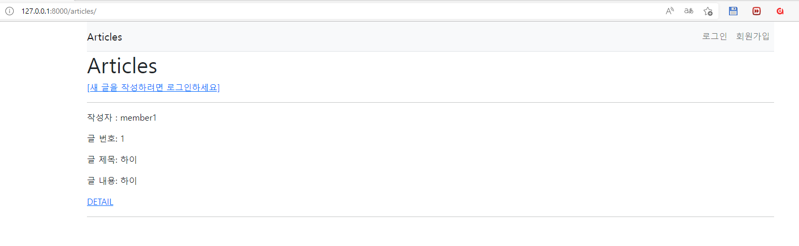
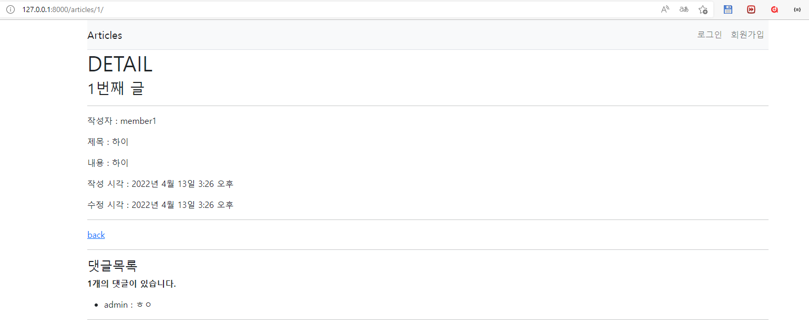
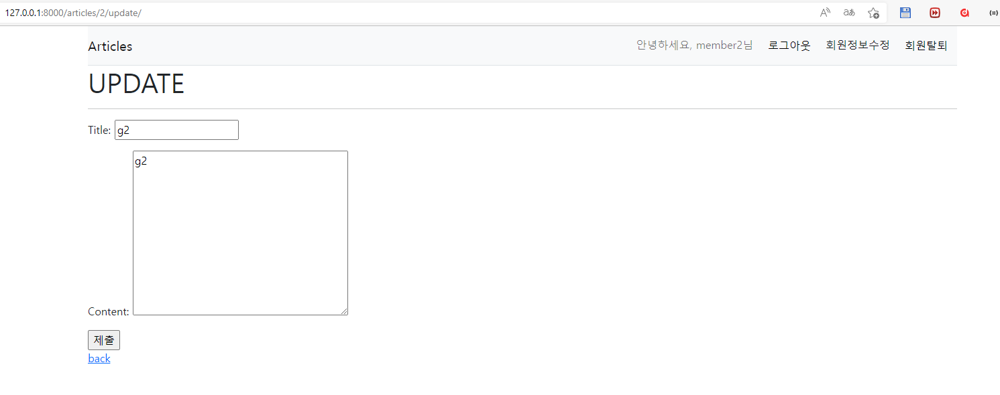
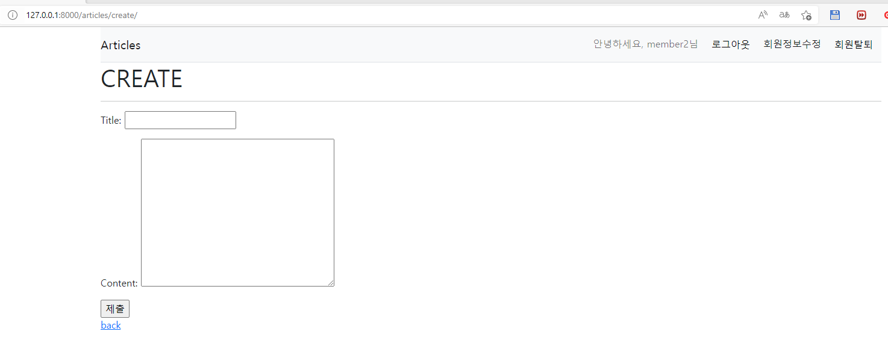
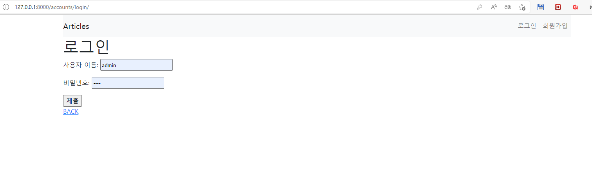
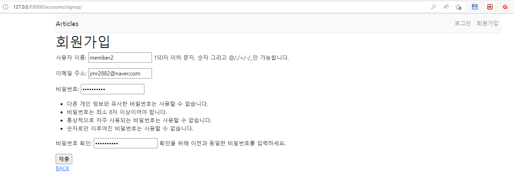
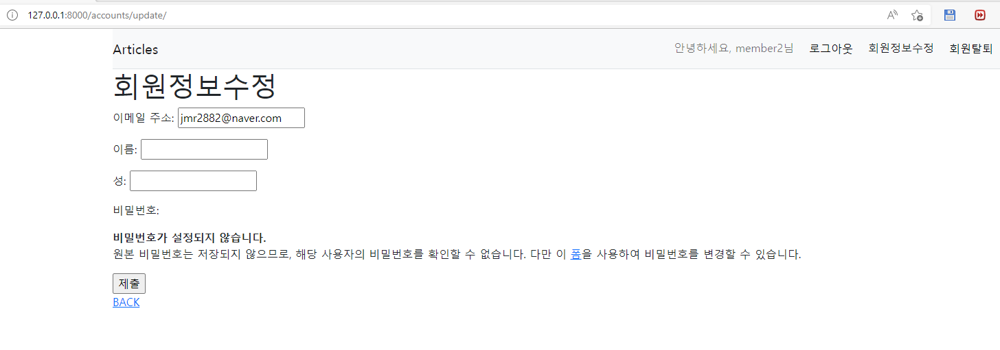
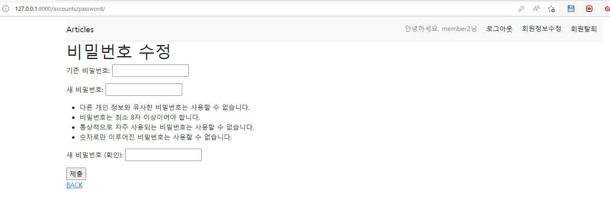

- python -m venv venv
- source venv/Scripts/activate (mac : source/venv/bin/activate)
- pip install django==3.2.12 (pip install -r requirements.txt)
- django-admin startproject crud .
- python manage.py startapp articles
- python manage.py startapp accounts
- settings.py -> installed_app에 articles, accounts 추가
- urls.py(프로젝트)

```python
from django.contrib import admin
from django.urls import path, include

urlpatterns = [
    path('admin/', admin.site.urls),
    path('articles/', include('articles.urls')),
    path('accounts/', include('accounts.urls')),
    
]
```

- urls.py(articles 앱)

```
from django.urls import path
from . import views

app_name = 'articles'
urlpatterns = [
    path('', views.index, name='index'),
    path('create/', views.create, name='create'), # GET / POST
    path('<int:pk>/', views.detail, name='detail'),
    path('<int:pk>/delete/', views.delete, name='delete'),
    path('<int:pk>/update/', views.update, name='update'), # GET / POST
    path('<int:pk>/comments/', views.comments_create, name='comments_create'), # GET / POST
    path('<int:article_pk>/comments/<int:comment_pk>/delete', views.comments_delete, name='comments_delete'), # GET / POST
    
]
```

- urls.py (accounts 앱)

```python
from django.urls import path
from . import views


app_name = 'accounts'
urlpatterns = [
    path('', views.index, name = 'index'),
    path('login/', views.login, name='login'),
    path('logout/', views.logout, name='logout'),
    path('signup/', views.signup, name='signup'),
    path('delete/', views.delete, name='delete'),
    path('update/', views.update, name='update'),
    path('password/', views.change_password, name='change_password'),

]

```

- <u>프로젝트, 앱 디렉토리와 동등한 위치</u>에 templates 폴더 생성 후 base.html만들기
- settings.py -> templates -> <u>DIRS : BASE_DIR / 'templates'</u>
- base.html에 부트스트랩 적용하고 블록 설정

  - Django Bootstrap Library
    - pip install django-bootstrap-v5
    - settings.py에서 installed_apps에 <u>'bootstrap5'</u> 추가

```html
<!DOCTYPE html>
<html lang="en">
<head>
  <meta charset="UTF-8">
  <meta http-equiv="X-UA-Compatible" content="IE=edge">
  <meta name="viewport" content="width=device-width, initial-scale=1.0">
  <link href="https://cdn.jsdelivr.net/npm/bootstrap@5.1.3/dist/css/bootstrap.min.css" rel="stylesheet" integrity="sha384-1BmE4kWBq78iYhFldvKuhfTAU6auU8tT94WrHftjDbrCEXSU1oBoqyl2QvZ6jIW3" crossorigin="anonymous">
  <title>Document</title>
</head>
<body>
  <div class="container">
  	#로그인과 비로그인 상태에서 출력되는 링크를 다르게 설정
    
    <nav class="navbar navbar-expand-lg navbar-light bg-light border-bottom">
      <a class="navbar-brand" href="">Articles</a>
      <button class="navbar-toggler ml-auto" type="button" data-toggle="collapse"
              data-target="#navbarNav" aria-controls="navbarNav"
              aria-expanded="false" aria-label="Toggle navigation">
          <span class="navbar-toggler-icon"></span>
      </button>
      <div class="d-flex justify-content-end collapse navbar-collapse flse-grow-0" id="navbarNav">
          <ul class="navbar-nav">
              <li class=" d-flex form-group nav-item">
              #현재 로그인 되어있는 유저 정보 출력
                <a class="nav-link" href="#">안녕하세요, {{user}}님</a>                                                                
                  <a class="nav-link active" href=""}>
                    <form action="" method = "POST">
                      
                      <input style="border:none; background:none;" type="submit" value = "로그아웃">
                    </form>
                    </a>                
                    <a class="nav-link active" href="">회원정보수정</a>
                    <a class="nav-link active" href=""}>
                    <form action="" method = 'POST'>
                      
                      <input style="border:none; background:none;" type="submit" value = "회원탈퇴">
                    </form>
                  </a>
              </li>
          </ul>
      </div>
  </nav>
    
    <nav class=" navbar navbar-expand-lg navbar-light bg-light border-bottom">
      <a class="navbar-brand" href="">Articles</a>
      <button class="navbar-toggler ml-auto" type="button" data-toggle="collapse"
              data-target="#navbarNav" aria-controls="navbarNav"
              aria-expanded="false" aria-label="Toggle navigation">
          <span class="navbar-toggler-icon"></span>
      </button>
      <div class="d-flex justify-content-end collapse navbar-collapse flse-grow-0" id="navbarNav">
          <ul class="navbar-nav">
              <li class="d-flex nav-item ">
                <a class = "nav-link" href="">로그인</a> #로그인 링크 작성
                <a class = "nav-link" href="">회원가입</a>                  
                    
              </li>
          </ul>
      </div>
  </nav>
      
    
    
    
  </div>
  <script src="https://cdn.jsdelivr.net/npm/bootstrap@5.1.3/dist/js/bootstrap.bundle.min.js" integrity="sha384-ka7Sk0Gln4gmtz2MlQnikT1wXgYsOg+OMhuP+IlRH9sENBO0LRn5q+8nbTov4+1p" crossorigin="anonymous"></script>
</body>
</html>

```

- articles/forms.py

  ```python
  from django import forms
  from .models import Article, Comment
  
  
  class ArticleForm(forms.ModelForm):
  
      class Meta:
          model = Article
          exclude = ('user',)
  
  class CommentForm(forms.ModelForm):
  
      class Meta:
          model = Comment
          fields = ('content',)
  ```

  

- accounts/forms.py

```python
from django.contrib.auth.forms import UserChangeForm, UserCreationForm
from django.contrib.auth import get_user_model

class CustomUserChangeForm(UserChangeForm):

    class Meta:
        model = get_user_model() #user
        fields = ('email', 'first_name', 'last_name')

class CustomUserCreationForm(UserCreationForm):

    class Meta(UserCreationForm.Meta):
        model = get_user_model() #user
        fields = UserCreationForm.Meta.fields + ('email',)

```


- articles/views.py

```python
from django.shortcuts import render, redirect, get_object_or_404
from django.views.decorators.http import require_http_methods, require_POST, require_safe
from django.contrib.auth.decorators import login_required
from .models import Article, Comment
from .forms import ArticleForm, CommentForm

# Create your views here.
@require_safe
def index(request):
    articles = Article.objects.order_by('-pk')
    context = {
        'articles': articles,
    }
    return render(request, 'articles/index.html', context)

@login_required
@require_http_methods(['GET', 'POST'])
def create(request):
    if request.method == 'POST':
        form = ArticleForm(request.POST)
        if form.is_valid():
            article = form.save(commit=False)
            article.user = request.user
            article.save()
            return redirect('articles:detail', article.pk)
    else:
        form = ArticleForm()
    context = {
        'form': form,
    }
    return render(request, 'articles/create.html', context)


@require_safe
def detail(request, pk):
    article = get_object_or_404(Article, pk=pk)
    comment_form = CommentForm()
    comments = article.comment_set.all()

    context = {
        'article': article,
        'comment_form' : comment_form,
        'comments' : comments,
    }
    return render(request, 'articles/detail.html', context)


@require_POST
def delete(request, pk):
    article = get_object_or_404(Article, pk=pk)
    if request.user.is_authenticated:
        if request.user == article.user:
            article.delete()
    return redirect('articles:index')


@login_required
@require_http_methods(['GET', 'POST'])
def update(request, pk):
    article = get_object_or_404(Article, pk=pk)
    if request.user == article.user:
        if request.method == 'POST':
            form = ArticleForm(request.POST, instance=article)
            if form.is_valid():
                article = form.save()
                return redirect('articles:detail', article.pk)
        else:
            form = ArticleForm(instance=article)
    else:
        return redirect('articles:index')
    context = {
        'article': article, 
        'form': form,
    }
    return render(request, 'articles/update.html', context)

@require_POST
def comments_create(request, pk):
    if request.user.is_authenticated:
        article = get_object_or_404(Article, pk=pk)
        comment_form = CommentForm(request.POST)
        if comment_form.is_valid():
            comment = comment_form.save(commit=False) #아직 데이터베이스에 저장되지 않은 인스턴스를 반환, 객체에 대한 사용자 지정처리를 수행할 때 유용
            comment.article = article #외래키 1
            comment.user = request.user #외래키 2
            comment.save()
        return redirect('articles:detail', article.pk)
    return redirect('accounts:login')

@require_POST
def comments_delete(request, article_pk, comment_pk):
    if request.user.is_authenticated:
        comment = get_object_or_404(Comment, pk=comment_pk)
        if request.user == comment.user:
            comment.delete()
    return redirect('articles:detail', article_pk)


```


- accounts/views.py

```python
from django.shortcuts import render, redirect
from django.contrib.auth.forms import AuthenticationForm,UserCreationForm, PasswordChangeForm
from django.contrib.auth import login as auth_login, logout as auth_logout, update_session_auth_hash, get_user_model
from .forms import CustomUserChangeForm, CustomUserCreationForm
from django.contrib.auth.decorators import login_required
from django.views.decorators.http import require_http_methods, require_POST
# Create your views here.

def index(request):
    User = get_user_model()
    users = User.objects.all()
    context = {
        'users' : users
    }
    return render(request, 'accounts/index.html', context)


@require_http_methods(['GET','POST'])
def login(request) :
    if request.user.is_authenticated: #로그인된 사용자는 로그인 버튼 볼 필요 없다
        return redirect('articles:index')

    if request.method == 'POST': #로그인 처리
        form = AuthenticationForm(request, request.POST)
        if form.is_valid():
            auth_login(request, form.get_user())
            return redirect(request.GET.get('next') or 'articles:index')

    else: #로그인 창
        form = AuthenticationForm()
    context = {
        'form' : form
    }
    return render(request, 'accounts/login.html', context)

@require_POST
def logout(request) : 
    if request.user.is_authenticated:
        auth_logout(request)
    return redirect('articles:index') 


def signup(request):
    if request.user.is_authenticated:
        return redirect('articles:index')
    if request.method == 'POST':
        form = CustomUserCreationForm(request.POST)
        if form.is_valid():
            #회원 가입 후 자동으로 로그인 진행하기
            user = form.save() 
            auth_login(request, user)
            return redirect('articles:index')
    else:
        form = CustomUserCreationForm()
    context = {
        'form':form
    }

    return render(request, 'accounts/signup.html', context)


@require_POST
def delete(request):
    if request.user.is_autenticated:
        request.user.delete()
        auth_logout(request) #탈퇴하면서 해당 유저의 세션 데이터도 함께 지움
    return redirect('articles:index')


@login_required
@require_http_methods(['GET','POST'])
def update(request):
    if request.method == 'POST':
        form = CustomUserChangeForm(request.POST, instance=request.user)
        if form.is_valid():
            form.save()
            return redirect('articles:index')
    else:
        form = CustomUserChangeForm(instance=request.user)
    context = {
        'form' : form,
    }
    return render(request, 'accounts/update.html', context)

@login_required
@require_http_methods(['GET','POST'])
def change_password(request):
    if request.method == 'POST':
        form = PasswordChangeForm(request.user, request.POST)
        if form.is_valid():
            user = form.save()
            update_session_auth_hash(request, user) #비밀번호 바꿔도 세션 유지
            return redirect('articles:index')
    else:
        form = PasswordChangeForm(request.user)
    context = {
        'form' : form,
    }
    return render(request, 'accounts/change_password.html', context)
```


- articles/models.py

```python
from django.conf import settings
from django.db import models


# Create your models here.
class Article(models.Model):
    user = models.ForeignKey(settings.AUTH_USER_MODEL, on_delete=models.CASCADE)
    title = models.CharField(max_length=10)
    content = models.TextField()
    created_at = models.DateTimeField(auto_now_add=True)
    updated_at = models.DateTimeField(auto_now=True)

    def __str__(self):
        return self.title


class Comment(models.Model):
    article = models.ForeignKey(Article, on_delete=models.CASCADE)
    user = models.ForeignKey(settings.AUTH_USER_MODEL, on_delete=models.CASCADE)
    content = models.CharField(max_length=200)
    created_at = models.DateTimeField(auto_now_add=True)
    updated_at = models.DateTimeField(auto_now=True)
    
    def __str__(self):
        return self.content

```

- accounts/models.py

```python
#관리자 권한과 함께 완전한 기능을 갖춘 user모델을 구현하는 기본 클래스인 AbstractUser을 상속받아 새로운 User모델 작성
from django.db import models
from django.contrib.auth.models import AbstractUser
# Create your models here.

class User(AbstractUser):
    pass

#settings.py
#기존에 Django가 사용하는 User모델이었던 auth 앱의 User 모델을 accounts 앱의 User모델을 사용하도록 변경

AUTH_USER_MODEL = 'accounts.User'
```

- admin.py에 model 등록

```
#articles/admin.py
from django.contrib import admin
from .models import Article, Comment

# Register your models here.
class ArticleAdmin(admin.ModelAdmin):
    list_display = ('pk', 'title', 'content', 'created_at', 'updated_at',)


admin.site.register(Article, ArticleAdmin)
admin.site.register(Comment)

#accounts/admin.py
#Custom User 모델 등록
from django.contrib import admin
from django.contrib.auth.admin import UserAdmin
from .models import User

admin.site.register(User, UserAdmin)
```


- python manage.py <u>makemigrations</u> 후 migrations/0001_initial.py 생성 확인

- python manage.py <u>migrate</u> (0001_initial.py를 실제 DB에 반영)

- vscode sqlite 확장 프로그램을 통해 확인

- python manage.py showmigrations 통해 설계도들이 migrate 됐는지 여부 확인 (생략 가능)

- model 수정하려면 추가 모델 필드 작성 후 makemigrations -> migrate

  (설계도 여러개 만들다가 sql문 꼬였을 시, 다 삭제하고 다시 makemigrations하는게 편함)

- pip install ipython, pip install django-extensions

- settings.py로 가서 'django_extensions' 앱 등록

- python manage.py shell_plus (이곳에서 DB API 사용 가능, shell 종료하려면 exit() 입력) 

- python manage.py createsuperuser (관리자 계정 생성)


1. articles/templates/articles/index.html



```html



  <h1>Articles</h1>
  
  <a href="">CREATE</a>
  
  <a href="">[새 글을 작성하려면 로그인하세요]</a>
  
  
  <hr>
  
    <p>작성자 : {{ article.user}} </p>
    <p>글 번호: {{ article.pk }}</p>  
    <p>글 제목: {{ article.title }}</p>
    <p>글 내용: {{ article.content }}</p>
    <a href="">DETAIL</a>
    <hr>
  


```


2. articles/templates/articles/detail.html



```html



  <h1>DETAIL</h1>
  <h3>{{ article.pk }}번째 글</h3>
  <hr>
  <p>작성자 : {{ article.user}} </p>
  <p>제목 : {{ article.title }}</p>
  <p>내용 : {{ article.content }}</p>
  <p>작성 시각 : {{ article.created_at }}</p>
  <p>수정 시각 : {{ article.updated_at }}</p>
  <hr>
  
  <a href="">수정</a>
  <form action="" method="POST">
    
    <input type="submit" value="삭제">
  </form>
  
  <a href="">back</a>
  <hr>
  <h4> 댓글목록 </h4>
  
    <p><b> {{comments|length}}개의 댓글이 있습니다. </b></p>
  
  <ul>
  
  <li>
    {{comment.user}} : {{comment.content}}
    
    <form action="" method="POST" class="d-inline">
      
      <input type="submit" value = "삭제">
    </form>
    
  </li>
  
  <p>댓글을 남겨보세요!</p>
  
</ul>
<hr>

<form action="" method="POST">
  
  {{comment_form}}
  <input type="submit">
</form>

<a href="">댓글을 작성하려면 로그인 하세요!</a>



```


3.articles/templates/articles/update.html



```html



  <h1>UPDATE</h1>
  <hr>
  <form action="" method="POST">
    
    {{ form.as_p }}
    <input type="submit">
  </form>
  <a href="">back</a>


```


4. articles/templates/articles/create.html



```html



  <h1>CREATE</h1>
  <hr>
  <form action="" method="POST">
    
    {{ form.as_p }}
    <input type="submit">
  </form>
  <a href="">back</a>


```


5. accounts/templates/accounts/login.html



```html




<h1>로그인</h1>
<form action="" method="POST">
    
    {{form.as_p}}
    <input type="submit">
</form>
<a href="">BACK</a>

```


6. accounts/templates/accounts/signup.html



```html




<h1>회원가입</h1>
<form action="" method="POST">
    
    {{form.as_p}}
    <input type="submit">
</form>
<a href="">BACK</a>

```

7.  accounts/templates/accounts/update.html



```html




<h1>회원정보수정</h1>
<form action="" method="POST">
    
    {{form.as_p}}
    <input type="submit">
</form>
<a href="">BACK</a>

```


8.  accounts/templates/accounts/change_password.html



```html




<h1>비밀번호 수정</h1>
<form action="" method="POST">
    
    {{form.as_p}}
    <input type="submit">
</form>
<a href="">BACK</a>

```

