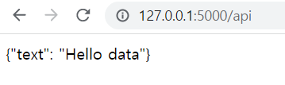
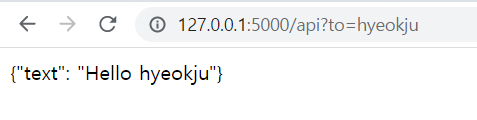
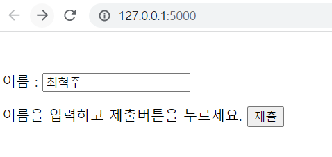
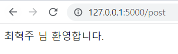

1. Flask 패키지 설치

```
pip install flask
```

2. 웹 서버 프로그램 만들기

```
from flask import Flask

app = Flask(__name__)

@app.route('/')
def  index():
	return  'Hello data'

if __name__ == "__main__":
	app.run(host='127.0.0.1', port=5000, debug=False)
```

3. 템플릿
   프로젝트 디렉터리 하위에 `templates`과 `static`디렉터리를 생성

```
//templates/index.html
<!DOCTYPE  HTML>

<html>

<head>

<title>Flask app</title>

</head>

<body>

<h1>Hello Flask!</h1>

</body>

</html>
```

```
//main.py
from  flask  import  Flask, render_template


app = Flask(__name__)


@app.route('/')

def  index():


return  render_template('index.html')

@app.route('/about')

def  about():

return  'About 페이지'


if  __name__ == "__main__":

app.run(host='127.0.0.1', port=5000, debug=False) #debug=True 코드 수정시 웹 서버 자동으로 다시 시작
```

`layout.html` 파일 하나를 변경함으로써 전 페이지에 변경사항을 적용

```
//templates/layout.html
<!DOCTYPE  HTML>

<html  lang="kr">

<head>

<meta  charset="utf-8">

<title>Flask 블로그</title>

</head>

<body>

<header>

<nav>

<a  href="/">Flask 블로그</a>

<a  href="/">Home</a>

<a  href="/about">About</a>

</nav>

<hr>

</header>

<main  role="main">

<!-- Main content block -->



</main>

</body>

</html>
```

```
//index.html




<div>

<div>

<article>

<h1>첫 번째 포스트 제목</h1>

<p>첫 번째 포스트 내용입니다.</p>

<div>

<p>작성자</p>

<p>2018-08-01</p>

</div>

</article>

<article>

<h1>두 번째 포스트 제목</h1>

<p>두 번째 포스트 내용입니다.</p>

<div>

<p>작성자</p>

<p>2018-08-01</p>

</div>

</article>

</div>

</div>


```

```
//templates/about.html




<div>

<h1>About</h1>

</div>


```

4. 템플릿에 파라미터 전송

```
//main.py
from  datetime  import  datetime

from  flask  import  Flask, render_template

app = Flask(__name__)

posts = [

{

'author': {

'username': 'test-user'

},

'title': '첫 번째 포스트',

'content': '첫 번째 포스트 내용입니다.',

'date_posted': datetime.strptime('2018-08-01', '%Y-%m-%d')

},

{

'author': {

'username': 'test-user'

},

'title': '두 번째 포스트',

'content': '두 번째 포스트 내용입니다.',

'date_posted': datetime.strptime('2018-08-03', '%Y-%m-%d')

},

]

@app.route('/')

@app.route('/index')

def  index():

return  render_template('index.html', posts=posts)

@app.route('/about')

def  about():

return  render_template('about.html', title='About')

if  __name__ == "__main__":

app.run(host='127.0.0.1', port=5000, debug=False)
```

```
//index.html




<div>

<div>



<article>

<h1>{{ post.title }}</h1>

<p>{{ post.content}}</p>

<div>

<p>{{ post.author.username }}</p>

<p>{{ post.date_posted.strftime('%Y-%m-%d') }}</p>

</div>

</article>



</div>

</div>


```

```
//layout.html
<!DOCTYPE  HTML>

<html  lang="kr">

<head>

<meta  charset="utf-8">



<title>Flask 블로그 - {{ title }}</title>



<title>Flask 블로그</title>



</head>

<body>

<header>

<nav>

<a  href="/">Flask 블로그</a>

<a  href="/">Home</a>

<a  href="/about">About</a>

</nav>

<hr>

</header>

<main  role="main">

<!-- Main content block -->



</main>

</body>

</html>
```

5. REST API

플라스크로 api 서버 구현하는 이유

- **API Server**를 **가볍게** 구현 할 수 있습니다.
- **Docker**나 **Kubernetes**를 이용해 여러 개의 컨테이너를 이용하여 스케쥴링이 용이 합니다.
- 일단 **쉽고, 코드가 짧습니다.** (매우 중요)

```
//main.py

from  flask  import  Flask

import  json


app = Flask(__name__)


@app.route('/api')

def  api():

d = {"text": "Hello data"}

return  json.dumps(d)


if  __name__ == "__main__":

app.run(host='127.0.0.1', port=5000, debug=False)
```



GET

```
from  flask  import  Flask

from  flask  import  request

import  json


app = Flask(__name__)

@app.route('/api', methods=['GET'])

def  api():

to = request.args.get('to')


d = {"text": "Hello {}".format(to)}

return  json.dumps(d)


if  __name__ == "__main__":

app.run(host='127.0.0.1', port=5000, debug=False)
```



POST

```
//templates/input.html
<!DOCTYPE  html>

<html>

<head>

<meta  charset="UTF-8">

<title>HTML for python flask</title>

</head>


<body>

<form  action="/post"  method="post">

​ <p>이름 : <input  type="text"  id="input"  name="input"></p>

<p>이름을 입력하고 제출버튼을 누르세요. <input  type="submit"  value="제출"  onclick="alert('제출 완료!')"  /></p>

</form>

</body>

</html>
```

```
//main.py
from  flask  import  Flask, render_template, request

app = Flask(__name__)


@app.route("/")

def  hello():

return  render_template('input.html')


@app.route("/post",methods=['POST'])

def  post():

value = request.form['input']

msg = "%s 님 환영합니다." %value

return  msg


if  __name__ == "__main__":

app.run()
```



